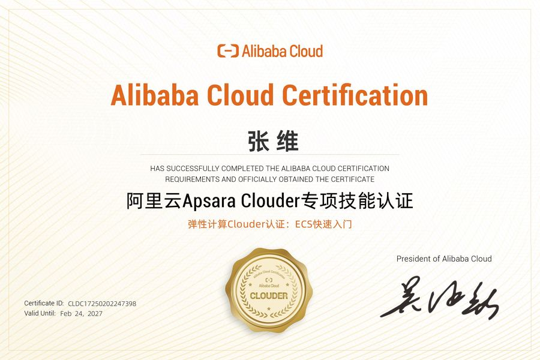
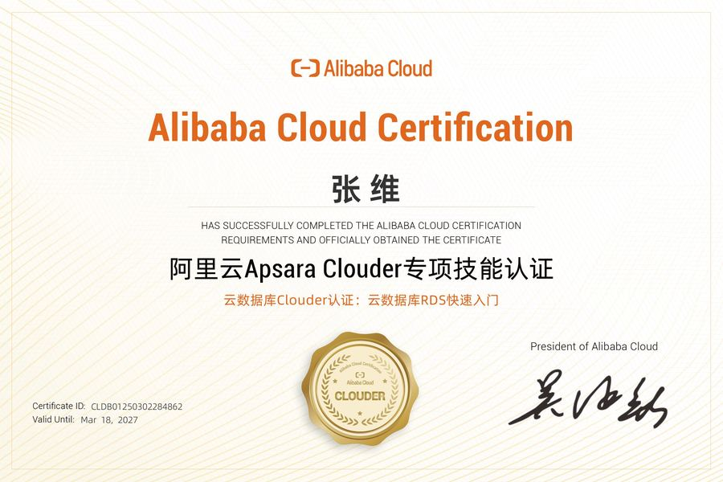
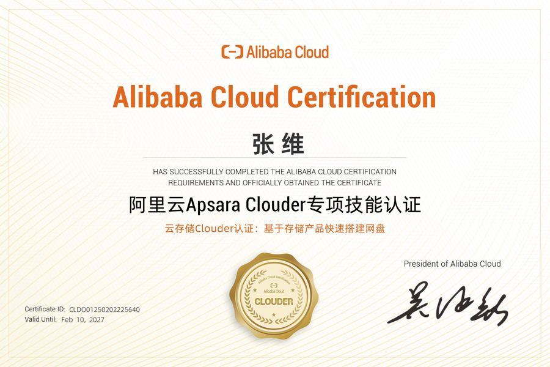
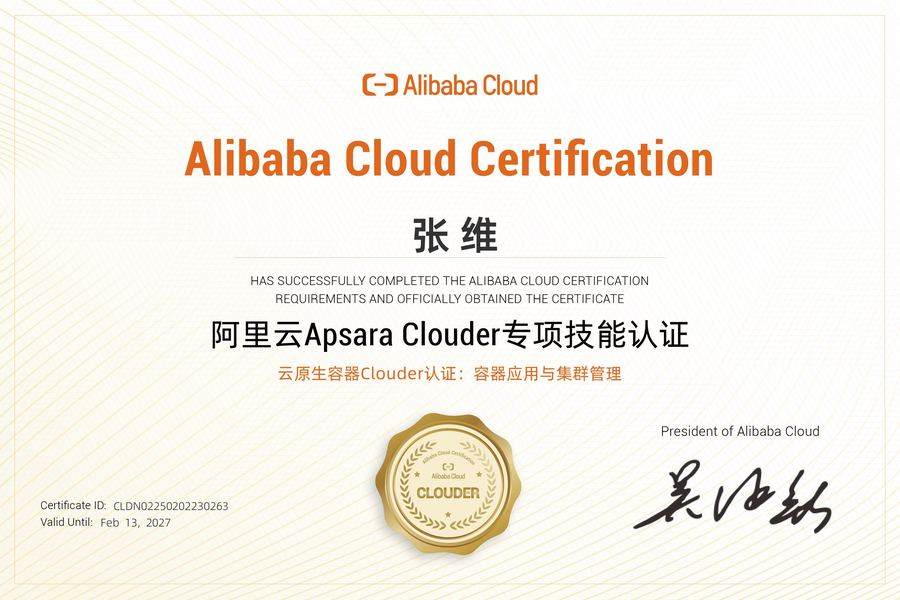
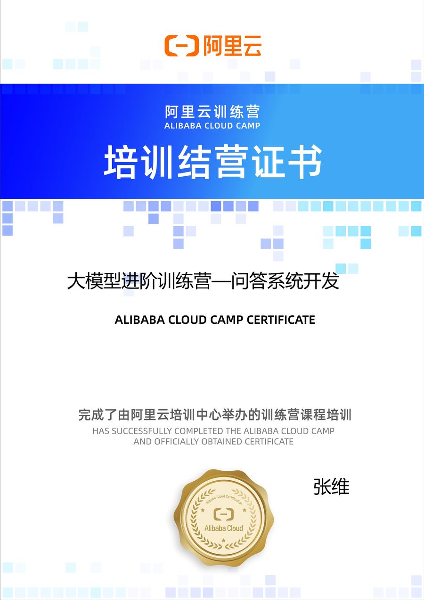
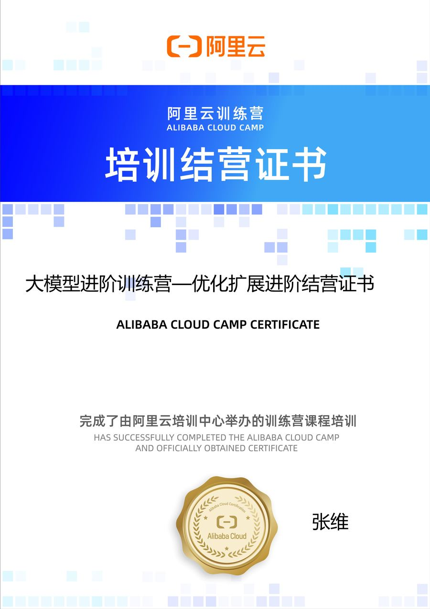
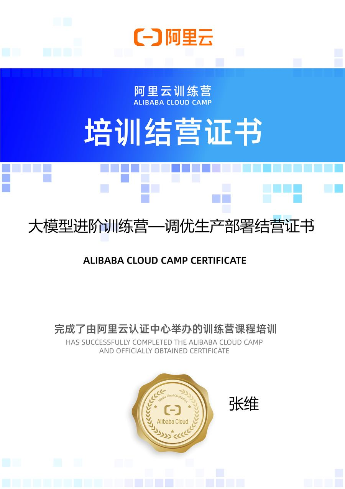
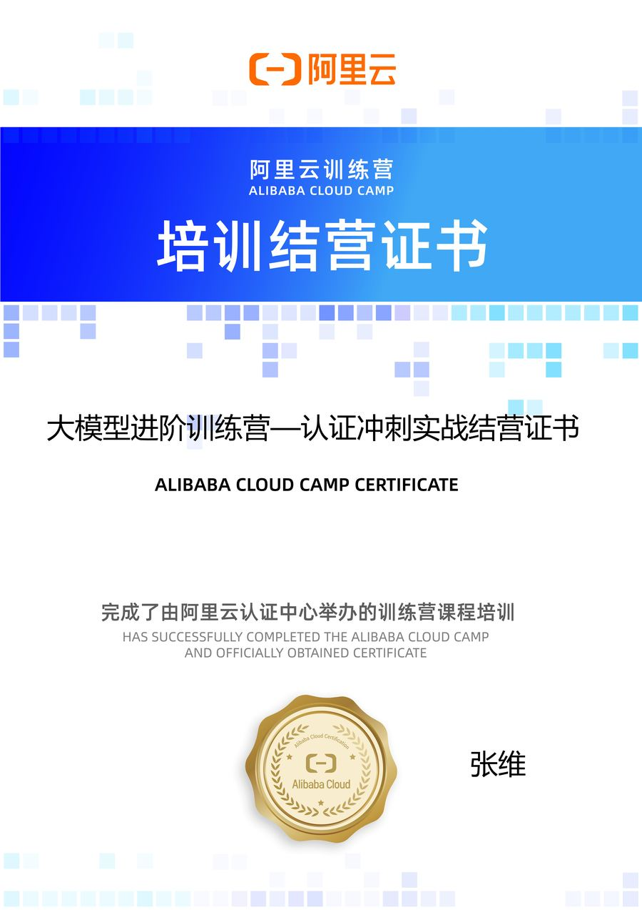
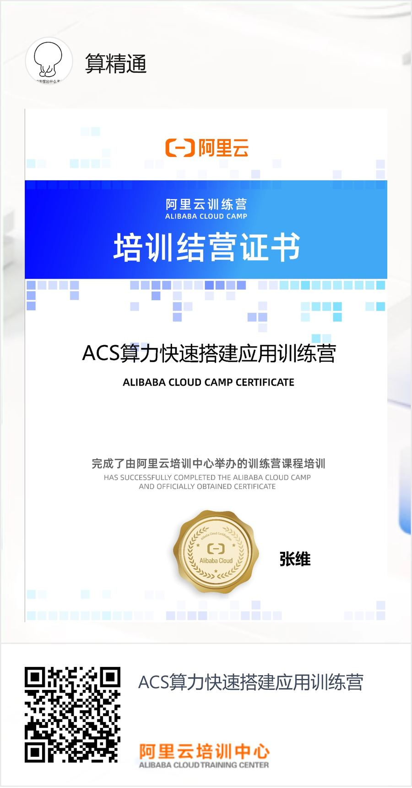

# 资质认证

工程能力的另一种证明方式：**拿证说明我系统学过，做出来说明我真的会用。** 下面这些认证都对应着我实际在用的技术栈，不是考完就丢的证书。

4阿里云专项技能认证

6训练营结营证书

1鸿蒙应用开发工程师

10+年开发经验

---

## 一、阿里云 Apsara Clouder 专项技能认证

覆盖云上最常用的四类资源：计算、数据库、存储、容器。

<figure>

<figcaption><strong>弹性计算</strong> 弹性计算 Clouder 认证：ECS 快速入门</figcaption>
</figure>
<figure>

<figcaption><strong>云数据库</strong> 云数据库 Clouder 认证：RDS 快速入门</figcaption>
</figure>
<figure>

<figcaption><strong>云存储</strong> 云存储 Clouder 认证：基于存储产品快速搭建网盘</figcaption>
</figure>
<figure>

<figcaption><strong>云原生容器</strong> 云原生容器 Clouder 认证：容器应用与集群管理</figcaption>
</figure>

| 认证方向 | 认证内容 | 有效期至 |
| --- | --- | --- |
| 弹性计算 | 弹性计算 Clouder 认证：ECS 快速入门 | 2027-02 |
| 云数据库 | 云数据库 Clouder 认证：云数据库 RDS 快速入门 | 2027-03 |
| 云存储 | 云存储 Clouder 认证：基于存储产品快速搭建网盘 | 2027-02 |
| 云原生容器 | 云原生容器 Clouder 认证：容器应用与集群管理 | 2027-02 |

## 二、阿里云训练营结营证书

**大模型进阶训练营**是一套完整的大模型应用工程课程，从环境准备一路做到生产部署与认证冲刺。五个阶段都完成了结营：

<figure>

<figcaption><strong>阶段一</strong> 环境筑基准备</figcaption>
</figure>
<figure>

<figcaption><strong>阶段二</strong> 问答系统开发</figcaption>
</figure>
<figure>

<figcaption><strong>阶段三</strong> 优化扩展进阶</figcaption>
</figure>
<figure>

<figcaption><strong>阶段四</strong> 调优生产部署</figcaption>
</figure>
<figure>

<figcaption><strong>阶段五</strong> 认证冲刺实战</figcaption>
</figure>
<figure>

<figcaption><strong>ACS 算力</strong> 算力快速搭建应用训练营</figcaption>
</figure>

| 训练营 | 主题 |
| --- | --- |
| 大模型进阶训练营 | 环境筑基准备 |
| 大模型进阶训练营 | 问答系统开发 |
| 大模型进阶训练营 | 优化扩展进阶 |
| 大模型进阶训练营 | 调优生产部署 |
| 大模型进阶训练营 | 认证冲刺实战 |
| ACS 算力快速搭建应用训练营 | 基于 ACS 算力快速搭建应用 |

## 三、鸿蒙应用开发工程师

**HarmonyOS 应用开发工程师认证（华为）** —— 鸿蒙应用开发方向的能力认证，对应 ArkTS / ArkUI 声明式开发与多端部署能力。

!!! note "证书图片待补"
    鸿蒙证书的扫描件暂未归档，后续补充。相关的鸿蒙工程实践（`guardian-huawei-live-course` 直播课程 Demo 等）已经在本地留有完整工程。

---

## 这些认证对应什么能力

证书只是索引，真正的能力在项目里。对应关系：

| 认证 | 对应到本站的哪部分 |
| --- | --- |
| 弹性计算 / 云存储 / 云数据库 | [技术栈 → 云服务与运维](stack.md)：ECS 部署、OSS 存储、RDS / Redis 选型 |
| 云原生容器 | [QuickClass](works/quickclass.md) · [QuickForm](works/quickform.md) 的 Docker 化与镜像优化 |
| 大模型进阶训练营（五阶段） | [QuickClass](works/quickclass.md) 的 LLM 对话、RAG 知识库、[QuickEmbed](works/quickembed.md) 向量化服务 |
| 鸿蒙应用开发 | 移动端开发能力（HarmonyOS + Android + 小程序） |

认证只是起点。想看我实际用这些能力做出来的东西，移步 <a href="works/">作品集</a>；想看技术深度，移步 <a href="capabilities/">能力清单</a>。

