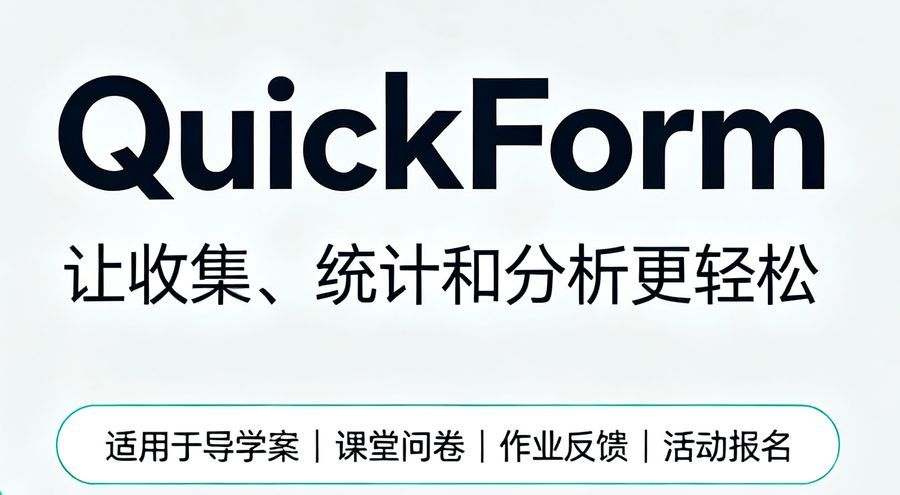

# QuickForm · 轻量级表单数据回收

!!! quote "一句话"
    把表单的「提交接口」开放出来——任何页面都能往同一个后台回传数据。

**访问站点**：[modeai-quickform.ms.show](https://modeai-quickform.ms.show) · **技术栈**：Docker · 开放 API · 数据大屏

---

## 解决什么问题

教学场景里的数据收集有个长期矛盾：

- 老师要收导学案、作业、问卷，希望用现成表单工具；
- 但这些工具**只允许在它自己的页面里填写**。

实际情况是：数据往往产生在别的地方。学生在一个 AI 生成的活动页里操作，在一个编程课程项目里提交作品，在自研教学平台的某个页面点了按钮——这些时候表单工具帮不上忙，只能手工汇总。

QuickForm 的做法是**把提交接口独立出来**。

---

## 核心能力

| 能力 | 说明 |
| --- | --- |
| **开放提交接口** | 提供标准提交 API，可接入任意网页、AI 生成页面、第三方课程活动页 |
| **提交名单可视** | 老师直观看到谁交了、谁没交，一眼掌握完成情况 |
| **数据在线查阅** | 收集到的数据在线浏览，支持筛选与详情查看 |
| **一键导出** | 收集结果一键导出，直接进入后续处理流程 |
| **AI 辅助分析** | 内置 AI 能力协助整理与分析收集到的数据 |
| **数据大屏** | 实时统计可视化，适合课堂投屏展示 |
| **极速搭建** | 几分钟即可创建一次收集任务 |

---

## 典型用法

**场景一：课堂互动数据回收**
学生在 AI 生成的互动探究页面上操作，页面把操作结果 POST 回 QuickForm。老师在大屏上实时看到全班进度。

**场景二：外部课程活动接入**
编程课上学生做完一个项目，项目页面直接提交作品链接与截图到 QuickForm 后台，不用再发微信群。

**场景三：教研问卷**
问卷由 AI 生成 HTML 页面托管在任意地方，提交接口指向 QuickForm——收集、查看、导出、分析一条龙。

---

## 技术要点

**AI 模型链式降级。**
平台的模型服务存活状态是动态变化的——今天可用的模型明天可能下架。因此调用层实现了 fallback 模型链：主模型不可用时自动尝试备选模型，避免因为单个模型下线导致 AI 功能整体不可用。这是一次真实故障（主模型下架导致请求 400）之后的改进。

**密钥管理走平台。**
敏感配置不写进代码，通过平台密钥接口下发，更新时替换即可生效。

---

## 和 QuickClass 的关系

QuickForm 与 QuickClass 是互补的：

- **QuickClass** 负责一节课的完整链路（对话、探究、测验、分析）；
- **QuickForm** 负责「把外部数据收回来」——当数据产生在 QuickClass 之外的页面时，用它做统一入口。

两个系统可以配合使用，也可以独立部署。
